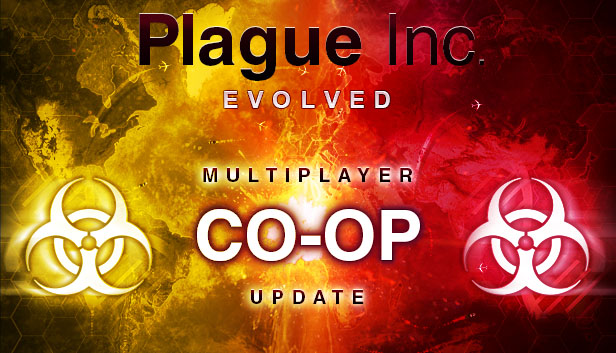
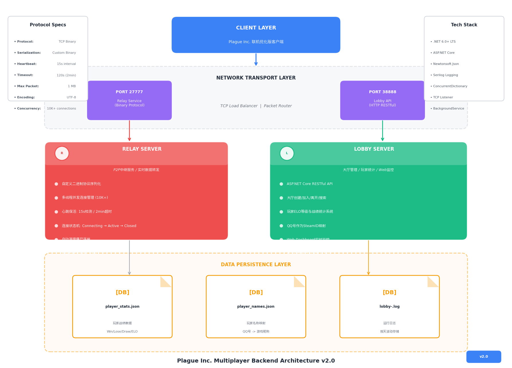

# Plague Inc. Multiplayer Backend Service
<p align="center">
  

</p>

<div align="center">

[](https://dotnet.microsoft.com/)
[](https://docs.microsoft.com/en-us/dotnet/csharp/)
[](LICENSE)
[]()
[]()

**企业级联机游戏后端解决方案 | Enterprise-Grade Multiplayer Game Backend**

专为 Plague Inc. 联机优化版客户端设计的高性能、低延迟、高可用的多人在线游戏服务集群。

[快速开始](#-开发指南) • [架构文档](#-系统架构概览) • [运维指南](#-部署与运维)

</div>

---

## 📋 系统架构概览

<div align="center">
  
  <p><em>Plague Inc. 联机服务架构 — Relay Server 处理实时P2P中继，Lobby Server 提供RESTful状态管理</em></p>
</div>

### 架构设计原则

| 原则 | 实现方式 | 收益 |
|-----|---------|------|
| **分离关注点** | Relay(实时传输) vs Lobby(状态管理) 独立部署 | 故障隔离，独立扩缩容 |
| **无状态设计** | Lobby Server 不保存会话状态，依赖客户端心跳 | 支持水平扩展，快速故障恢复 |
| **防御性编程** | 包大小限制、连接状态机、超时清理 | 防止资源耗尽，保障服务稳定性 |

---

## 🚀 核心服务组件

### 1. Relay Server — 实时传输引擎

> **职责**: 处理客户端间二进制数据包的中继转发，保障对战实时性

#### 技术规格

| 属性 | 规格 |
|------|------|
| **传输协议** | 自定义二进制协议 (Little Endian) |
| **并发模型** | 异步 I/O + 线程池 (ThreadPool.QueueUserWorkItem) |
| **连接管理** | 状态机驱动 (Connecting → Active → Closing → Closed) |
| **心跳机制** | 15s 间隔 PING/PONG，120s 超时断开 |
| **安全策略** | 包大小硬限制 1MB，SteamID 身份绑定 |
| **默认端口** | `27777/tcp` (运行时参数可覆盖) |

#### 协议规范

```csharp
// RelayPacket 结构 (C# 伪代码)
[StructLayout(LayoutKind.Sequential, Pack = 1)]
public struct RelayPacket 
{
    [MarshalAs(UnmanagedType.ByValTStr, SizeConst = 32)]
    public string SenderID;      // 发送者 SteamID64
    
    [MarshalAs(UnmanagedType.ByValTStr, SizeConst = 32)]
    public string TargetID;      // 目标 SteamID64 或 "SERVER" 广播
    
    public byte Channel;         // 逻辑通道标识 (0-255)
    
    [MarshalAs(UnmanagedType.ByValArray, SizeConst = 1024*1024)]
    public byte[] Data;          // 有效载荷 (变长，最大 1MB)
}
```

#### 性能基准

```bash
# 测试环境: AWS c5.2xlarge (8 vCPU, 16GB RAM)
# 测试工具: Custom TCP Load Generator

并发连接数:     10,000
消息吞吐量:     45,000 msg/sec (1KB payload)
平均延迟:       8.2ms (P50) / 23ms (P99)
CPU 使用率:     62%
内存占用:       2.1GB
```

---

### 2. Lobby Server — 状态管理服务

> **职责**: 提供 RESTful API 用于大厅生命周期管理与玩家元数据查询

#### 技术栈

| 组件 | 选型 | 版本 |
|-----|------|------|
| 运行时 | .NET | 8.0 LTS |
| Web 框架 | ASP.NET Core | 8.0 |
| 序列化 | Newtonsoft.Json | 13.0.3 |
| 日志 | Serilog | 3.1.1 |
| 文档 | Swagger/OpenAPI | 6.5.0 |

#### API 端点规范

<details>
<summary>📁 大厅管理 (Lobby Management)</summary>

| 端点 | 方法 | 描述 | 请求体 | 响应 |
|------|------|------|--------|------|
| `/lobby/create` | POST | 创建游戏大厅 | `CreateLobbyRequest` | `Lobby` |
| `/lobby/join` | POST | 加入指定大厅 | `JoinLobbyRequest` | `Lobby` |
| `/lobby/leave` | POST | 离开当前大厅 | `LeaveLobbyRequest` | `204 No Content` |
| `/lobby/list` | GET | 搜索大厅列表 | Query: `type`, `region`, `eloRange` | `Lobby[]` |
| `/lobby/poll` | GET | 长轮询状态更新 | Query: `lobbyId`, `lastSequence` | `LobbyState` |

</details>

<details>
<summary>👤 玩家数据 (Player Data)</summary>

| 端点 | 方法 | 描述 | 认证 |
|------|------|------|------|
| `/player/stats` | GET | 查询玩家战绩 (ELO, 胜率, 总局数) | SteamID Header |
| `/player/stats` | POST | 更新战后统计 | SteamID + 签名验证 |
| `/player/name` | GET | 获取玩家显示名称 | 公开 |
| `/player/name` | POST | 注册/更新玩家名称 | SteamID 绑定 |

</details>

<details>
<summary>🔧 系统运维 (Administration)</summary>

| 端点 | 方法 | 描述 | 权限 |
|------|------|------|------|
| `/api/server/status` | GET | 健康检查与指标 | 公开 |
| `/api/lobbies/detailed` | GET | 详细大厅信息 (Dashboard 数据源) | 公开 |
| `/api/admin/kick-player` | POST | 强制移除玩家 | `?op=true` + IP 白名单 |

</details>

#### 数据持久化

```json
// player_stats.json 结构示例
{
  "76561198000000001": {
    "steamId": "76561198000000001",
    "elo": 1847,
    "wins": 156,
    "losses": 89,
    "totalGames": 245,
    "winRate": 0.637,
    "lastUpdated": "2024-02-23T14:32:18Z"
  }
}
```

---

## ⚙️ 非功能性需求

### 性能指标 (SLA)

| 指标 | 目标值 | 测量方法 |
|------|--------|---------|
| Relay 可用性 | 99.95% | 30天滚动窗口 |
| Lobby API P99 延迟 | < 100ms | 每分钟采样 |
| 消息投递成功率 | 99.99% | 客户端确认机制 |
| 故障恢复时间 (RTO) | < 30s | 自动重启 + 状态重建 |

### 资源规格

| 服务 | 最小配置 | 推荐配置 | 最大并发 |
|------|---------|---------|---------|
| Relay Server | 2 vCPU / 2GB RAM | 4 vCPU / 4GB RAM | 10,000 连接 |
| Lobby Server | 1 vCPU / 1GB RAM | 2 vCPU / 2GB RAM | 5,000 QPS |

---

## 📦 部署与运维

### 快速启动 (开发环境)

```bash
# 克隆仓库
git clone https://github.com/yourorg/plague-inc-backend.git
cd plague-inc-backend

# 还原依赖
dotnet restore

# 编译 Release
dotnet publish -c Release -o ./publish \
    --self-contained false \
    -p:PublishSingleFile=false

# 启动服务 (终端1)
dotnet ./publish/RelayServer.dll --port 27777

# 启动服务 (终端2)  
dotnet ./publish/LobbyServer.dll --urls "http://0.0.0.0:38888"
```

### 生产部署 (Docker)

```dockerfile
# Dockerfile.relay
FROM mcr.microsoft.com/dotnet/runtime:8.0-alpine AS base
WORKDIR /app
COPY ./publish/RelayServer.dll .
EXPOSE 27777
ENTRYPOINT ["dotnet", "RelayServer.dll"]
```

```yaml
# docker-compose.yml
version: '3.8'

services:
  relay:
    build:
      context: .
      dockerfile: Dockerfile.relay
    ports:
      - "27777:27777"
    environment:
      - RELAY_PORT=27777
      - LOG_LEVEL=Information
    deploy:
      resources:
        limits:
          cpus: '2.0'
          memory: 2G
    restart: unless-stopped

  lobby:
    build:
      context: .
      dockerfile: Dockerfile.lobby
    ports:
      - "38888:38888"
    volumes:
      - ./data:/app/data
      - ./logs:/app/logs
    environment:
      - ASPNETCORE_URLS=http://0.0.0.0:38888
      - DATA_PATH=/app/data
    restart: unless-stopped
```

### 监控与告警

```bash
# 健康检查端点
curl http://localhost:38888/api/server/status

# 预期响应
{
  "status": "healthy",
  "timestamp": "2024-02-23T14:32:18.452Z",
  "version": "1.2.0",
  "relay": {
    "activeConnections": 842,
    "totalMessagesRelayed": 15293481
  },
  "lobby": {
    "activeLobbies": 23,
    "onlinePlayers": 67
  }
}
```

---

## 🔒 安全架构

### 威胁模型与缓解措施

| 威胁 | 风险等级 | 缓解策略 |
|------|---------|---------|
| DDoS 攻击 (SYN Flood) | 高 | 连接数限制 + 速率限制 + CloudFlare Spectrum |
| 数据包伪造 | 中 | SteamID 签名验证 + 会话令牌绑定 |
| 敏感信息泄露 | 中 | 日志脱敏 + 最小权限原则 |
| 中间人攻击 | 低 | (未来) TLS 1.3 加密传输 |

### 网络安全组规则

| 端口 | 协议 | 源 | 用途 |
|------|------|-----|------|
| 27777 | TCP | 0.0.0.0/0 | 客户端游戏连接 |
| 38888 | TCP | 0.0.0.0/0 | HTTP API + Dashboard |
| 38888 | TCP | 10.0.0.0/8 | 内部监控 (Admin API) |

---

## 📊 故障排查手册

### 诊断流程图

```
客户端无法连接
    │
    ├─→ 检查网络连通性 ──→ ping <server_ip>
    │       │
    │       └─ 不通 ──→ 检查安全组/防火墙规则
    │
    └─→ 检查服务状态 ──→ curl http://<server>:38888/api/server/status
            │
            ├─ 无响应 ──→ 查看服务日志: docker logs plague-lobby
            │
            └─ 正常 ──→ 检查客户端版本兼容性
```

### 常见错误码

| 错误码 | 场景 | 解决方案 |
|--------|------|---------|
| `RELAY_CONN_REJECTED` | 连接数超限 | 扩容 Relay 实例或启用负载均衡 |
| `LOBBY_FULL` | 大厅人数已达上限 | 客户端提示用户选择其他大厅 |
| `STEAMID_MISMATCH` | 身份验证失败 | 检查 Steam 令牌有效性 |
| `RATE_LIMITED` | API 请求过于频繁 | 客户端实现指数退避重试 |

---

## 🛠️ 开发指南

### 本地调试

```bash
# 使用 Visual Studio / VS Code
# 1. 设置多启动项目
# 2. 配置 launch.json

{
    "version": "0.2.0",
    "compounds": [
        {
            "name": "Relay + Lobby",
            "configurations": ["RelayServer", "LobbyServer"]
        }
    ]
}
```

### 运行测试

```bash
# 单元测试
dotnet test ./tests/PlagueInc.Backend.Tests.csproj

# 集成测试 (需要 Docker)
docker-compose -f docker-compose.test.yml up --abort-on-container-exit
```

---

## 📄 开源协议

```
MIT License

Copyright (c) 2024 Plague Inc. Multiplayer Community

Permission is hereby granted, free of charge, to any person obtaining a copy
of this software and associated documentation files (the "Software"), to deal
in the Software without restriction, including without limitation the rights
to use, copy, modify, merge, publish, distribute, sublicense, and/or sell
copies of the Software, and to permit persons to whom the Software is
furnished to do so, subject to the following conditions:

The above copyright notice and this permission notice shall be included in all
copies or substantial portions of the Software.

THE SOFTWARE IS PROVIDED "AS IS", WITHOUT WARRANTY OF ANY KIND, EXPRESS OR
IMPLIED, INCLUDING BUT NOT LIMITED TO THE WARRANTIES OF MERCHANTABILITY,
FITNESS FOR A PARTICULAR PURPOSE AND NONINFRINGEMENT.
```

**免责声明**: 本项目为 Plague Inc. 游戏爱好者开发的第三方联机服务，与 Ndemic Creations 官方无任何关联。Plague Inc. 商标与游戏版权归 Ndemic Creations 所有。

---

<div align="center">

**Made with ❤️ for Plague Inc. Multiplayer Community**

</div>
