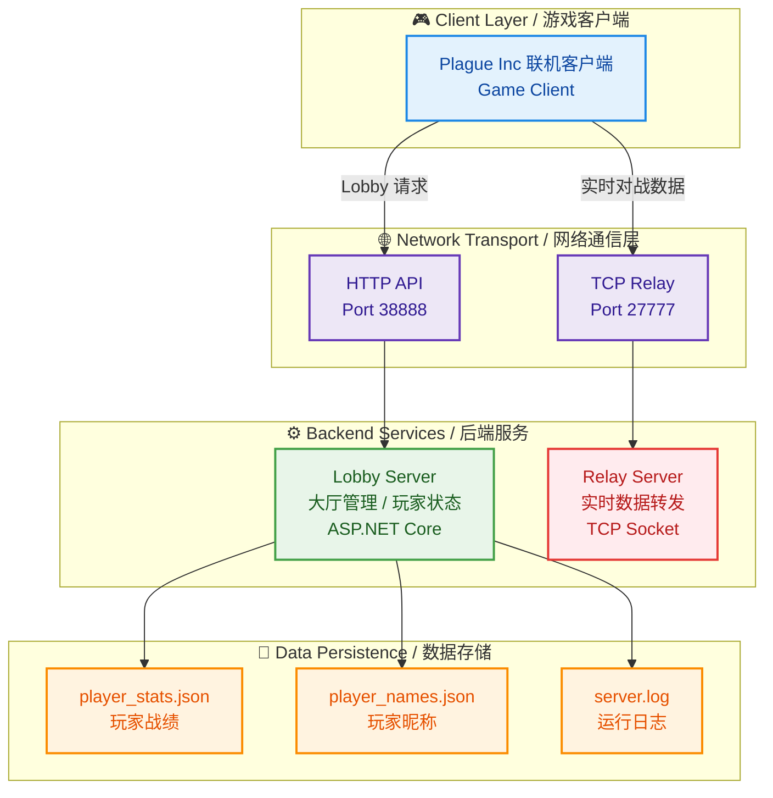


# Plague Inc. Multiplayer Backend Service

<p align="center">
  
  
</p>

<div align="center">

[](https://dotnet.microsoft.com/)
[](https://learn.microsoft.com/dotnet/csharp/)
[](LICENSE)
[]()

**Lightweight Multiplayer Game Backend**

为《瘟疫公司》联机客户端提供大厅管理与实时通信支持的轻量级后端服务。

</div>

---

## 📋 项目概述

本项目是一个个人实现的多人联机游戏后端，用于支持《瘟疫公司》联机补丁的在线对战功能。

项目目标并非构建高并发商业游戏服务器，而是完成：

* 实时网络通信服务设计
* 游戏大厅生命周期管理
* 长连接服务稳定运行
* 低成本云服务器部署实践

当前服务已长期运行在公网服务器环境中。

---

## 🏗 系统架构概览



系统采用 **Lobby + Relay 双服务拆分结构**：

| 服务               | 职责             | 通信方式      |
| ---------------- | -------------- | --------- |
| **Lobby Server** | 大厅管理、玩家信息、状态查询 | HTTP REST |
| **Relay Server** | 游戏实时数据中继       | TCP 长连接   |

设计目的：

* 将实时通信与业务逻辑解耦
* 降低单服务复杂度
* 便于后续扩展或独立优化

---

## 🚀 核心服务组件


### Relay Server — 实时通信中继

负责客户端之间的游戏数据转发。

#### 实现特点

* 基于 TCP Socket
* 自定义二进制协议
* 长连接通信
* 心跳检测与超时断开
* 数据包大小限制防止异常占用

连接生命周期：

```
Connecting → Active → Timeout → Closed
```

当前实现以 **稳定与易维护优先**：

* 每连接独立处理收发逻辑
* 未引入 IOCP / epoll 等复杂模型
* 方便调试与问题定位

适用于中小规模在线场景。

---

### Lobby Server — 大厅管理服务

提供 HTTP API 用于管理游戏会话。

#### 技术栈

| 组件            | 技术              |
| ------------- | --------------- |
| Runtime       | .NET 8          |
| Framework     | ASP.NET Core    |
| Serialization | Newtonsoft.Json |
| Logging       | Serilog         |
| API 文档        | Swagger         |

主要功能：

* 创建 / 加入大厅
* 玩家状态维护
* 房间列表查询
* 战绩信息管理
* 服务状态监控接口

---

## 💾 数据持久化方案

为降低部署成本与复杂度，项目采用轻量存储方案：

| 数据   | 存储方式    |
| ---- | ------- |
| 玩家统计 | JSON 文件 |
| 玩家名称 | JSON 文件 |
| 在线大厅 | 内存结构    |
| 持久化  | 定时写盘    |

优势：

* 无数据库依赖
* 单机部署简单

限制：

* 不支持多实例共享状态
* 服务重启期间存在短暂状态恢复过程

---

## ⚙️ 实际部署环境

### 服务器配置

| 项目   | 配置                  |
| ---- |---------------------|
| CPU  | 2 vCPU              |
| 内存   | 2 GB                |
| 系统   | Windows Server 2012 |
| 带宽   | ≈3 Mbps             |
| 部署方式 | 直接 dotnet 运行        |

```bash
dotnet LobbyServer.dll --urls "http://0.0.0.0:38888"
dotnet RelayServer.dll --port 27777
```

未使用容器化部署，主要考虑低配置服务器的资源占用。

---

## 📊 实际运行表现

在上述环境中：

* 稳定支持 **30–50 名玩家同时在线**
* CPU 使用率约 40%–60%
* 内存占用约 800MB–1.2GB

当前主要限制因素：

* 服务器带宽
* Relay 线程模型的资源开销

项目定位：

> 面向小规模真实在线运行场景，而非高并发商业部署。

---

## 🔒 稳定性设计

已实现的基础保护机制：

* TCP 心跳检测
* 空闲连接清理
* 数据包大小限制
* 异常连接释放
* 定时数据持久化
* 服务健康检查接口

用于保证长期运行稳定性。

---

## 📦 部署说明

### 构建

```bash
dotnet restore
dotnet publish -c Release -o ./publish
```

### 启动

```bash
dotnet ./publish/RelayServer.dll
dotnet ./publish/LobbyServer.dll
```

---

## 📈 后续优化方向

未来计划改进方向：

### 网络层

* 使用 SocketAsyncEventArgs
* 降低线程数量
* 提升连接密度

### 架构层

* Relay 多实例支持
* 状态服务外置（Redis）

### 数据层

* JSON → SQLite/PostgreSQL
* 更安全的数据更新策略

### 运维

* Docker 化部署
* 基础监控与日志聚合


---

## 📄 开源协议

```
MIT License

Copyright (c) 2024 Plague Inc. Multiplayer Community

Permission is hereby granted, free of charge, to any person obtaining a copy
of this software and associated documentation files (the "Software"), to deal
in the Software without restriction, including without limitation the rights
to use, copy, modify, merge, publish, distribute, sublicense, and/or sell
copies of the Software, and to permit persons to whom the Software is
furnished to do so, subject to the following conditions:

The above copyright notice and this permission notice shall be included in all
copies or substantial portions of the Software.

THE SOFTWARE IS PROVIDED "AS IS", WITHOUT WARRANTY OF ANY KIND, EXPRESS OR
IMPLIED, INCLUDING BUT NOT LIMITED TO THE WARRANTIES OF MERCHANTABILITY,
FITNESS FOR A PARTICULAR PURPOSE AND NONINFRINGEMENT.
```

**免责声明**: 本项目为 Plague Inc. 游戏爱好者开发的第三方联机服务，与 Ndemic Creations 官方无任何关联。Plague Inc. 商标与游戏版权归 Ndemic Creations 所有。

---

<div align="center">

**Made with ❤️ for Plague Inc. Multiplayer Community**

</div>
