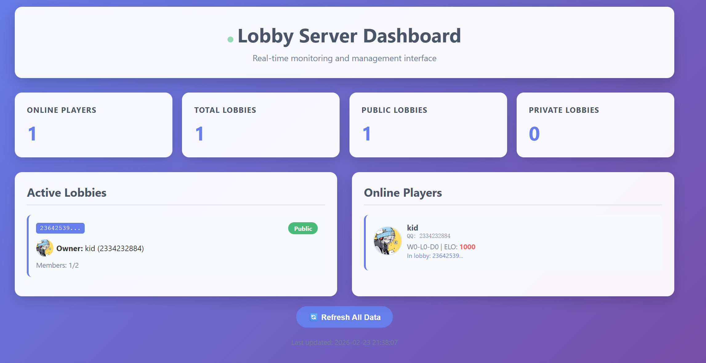


# Plague Inc. Multiplayer Backend Service

**企业级联机游戏后端解决方案 | Enterprise-Grade Multiplayer Game Backend**

专为 Plague Inc. 联机优化版客户端设计的高性能游戏服务器集群，提供稳定、低延迟的多人在线游戏体验。

---

## 📋 系统架构概览


---

## 🚀 核心服务组件

### 1. Relay Server
**P2P 网络中继服务** — 处理客户端间的实时数据传输

| 特性 | 说明 |
|------|------|
| **协议** | 自定义二进制协议，高效序列化 |
| **并发** | 多线程异步处理，支持高并发连接 |
| **心跳机制** | 15秒间隔检测，2分钟超时自动清理 |
| **安全策略** | 包大小限制(1MB)、连接状态机管理 |
| **端口** | `27777` (可通过命令行参数自定义) |

**数据包结构:**
```csharp
RelayPacket {
    SenderID:   string   // 发送者SteamID
    TargetID:   string   // 目标SteamID / "SERVER"
    Channel:    byte     // 数据通道标识
    Data:       byte[]   // 有效载荷
}
```

### 2. Lobby Server 
**游戏大厅管理服务** — ASP.NET Core 高性能 Web API

| 端点 | 方法 | 功能 |
|------|------|------|
| `/lobby/create` | POST | 创建游戏大厅 |
| `/lobby/join` | POST | 加入指定大厅 |
| `/lobby/leave` | POST | 离开大厅 |
| `/lobby/list` | GET | 搜索/过滤大厅列表 |
| `/lobby/poll` | GET | 轮询大厅状态更新 |
| `/player/stats` | GET/POST | 玩家战绩查询/更新 |
| `/player/name` | GET/POST | 玩家名称管理 |
| `/api/server/status` | GET | 服务器状态监控 |
| `/api/lobbies/detailed` | GET | 详细大厅信息 (Dashboard) |
| `/api/admin/kick-player` | POST | 管理员踢人 (需`?op=true`) |

**端口:** `38888` (绑定所有网卡 `0.0.0.0`)

---

## ⚙️ 技术规格

### 依赖要求
- **.NET 6.0+** (推荐 .NET 8.0 LTS)
- **Newtonsoft.Json** 13.0.1+
- **Serilog** 日志框架
- **ASP.NET Core** Web 运行时

### 性能参数
| 指标 | 数值 |
|------|------|
| 单 Relay 实例最大并发 | 10,000+ 连接 |
| Lobby API 响应时间 | < 50ms (P95) |
| 心跳检测间隔 | 15秒 |
| 不活跃玩家清理 | 15秒无响应自动踢出 |
| 数据包大小限制 | 1 MB |
| 日志滚动策略 | 按天切割，保留30天 |

---

## 📦 部署指南

### 快速启动

```bash
# 1. 编译项目
dotnet publish -c Release -o ./publish

# 2. 启动 Relay Server (默认端口 27777)
dotnet ./publish/RelayServer.dll
# 或自定义端口
dotnet ./publish/RelayServer.dll 27778

# 3. 启动 Lobby Server (端口 38888)
dotnet ./publish/LobbyServer.dll
```

### 生产环境配置

```bash
# 创建服务目录
mkdir -p /opt/plague-server/{relay,lobby,logs,data}

# 设置权限 (Linux)
chmod +x /opt/plague-server/*.dll

# 使用 systemd 托管 (推荐)
sudo systemctl enable plague-relay
sudo systemctl enable plague-lobby
sudo systemctl start plague-relay
sudo systemctl start plague-lobby
```

### 目录结构
```
/opt/plague-server/
├── relay/
│   └── RelayServer.dll
├── lobby/
│   └── LobbyServer.dll
├── logs/
│   ├── lobby-.log20240223.txt
│   └── lobby-.log20240224.txt
└── data/
    ├── player_stats.json      # 玩家战绩持久化
    └── player_names.json      # 玩家名称映射
```

---

## 🔒 安全与监控

### 内置安全机制
- **SteamID 强制验证**: 所有数据包自动校验发送者身份
- **连接状态机**: Connecting → Active → Closing → Closed
- **重复连接处理**: 自动关闭旧连接，防止幽灵会话
- **管理员模式**: Web Dashboard 通过 `?op=true` 参数启用踢人功能

### 监控端点
访问 `http://服务器IP:38888/` 查看实时监控 Dashboard：


**Dashboard 功能:**
- 实时在线人数 / 大厅数量统计
- 玩家 ELO 等级分布可视化
- 大厅详情与成员管理
- QQ 头像集成显示
- 管理员踢人操作 (需开启 Admin Mode)

---

## 🔧 客户端兼容性

> ⚠️ **重要提示**: 本后端服务**必须配合 Plague Inc. 联机优化版客户端使用**

---

## 📊 故障排查

### 常见问题排查

| 现象 | 可能原因 | 解决方案 |
|------|---------|---------|
| 客户端无法连接 Relay | 防火墙/端口未开放 | 检查 `27777/tcp` 端口 |
| 大厅列表为空 | 过滤条件不匹配 | 检查 `lobbyType` 参数 |
| 玩家被意外踢出 | 心跳超时 | 检查客户端 PONG 响应 |
| Dashboard 无法加载 | 静态资源路径错误 | 确认服务运行在根路径 |

---


## 📄 开源协议

本项目采用 **MIT License** 开源，允许自由修改与商业使用。

**免责声明**: 本项目为 Plague Inc. 游戏爱好者开发的第三方联机服务，与 Ndemic Creations 官方无关。

---

## 📞 技术支持

- **问题反馈**: 请提交 Issue 至项目仓库
- **客户端下载**: 请联系获取联机优化版客户端
- **服务器托管**: 支持 Docker / Kubernetes 部署方案

---

**Made with ❤️ for Plague Inc. Multiplayer Community**